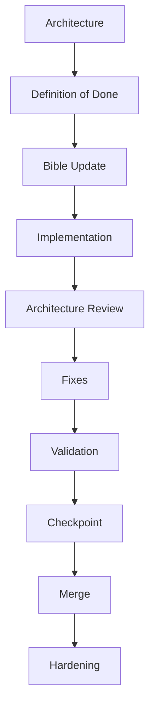

# Delivery Workflow

## التصميم المعماري إلى الدمج

## تفاصيل كل مرحلة

### Architecture
- تحديد حدود capability وتحديد تأثيرها على الأجزاء الحالية.
- اعتماد نهج reuse بدل duplication.
- تحديد dependencies واضحة بين الميزات.

### Definition of Done
- تفعيل checklist من [Definition of Done](04-definition-of-done.md) وتخصيصها داخل سجل الـ capability.
- تحديد مخرجات التحقق والتقارير المطلوبة قبل التنفيذ.

### Bible Update
- تحديث النقاط ذات الصلة في Product Bible عند وجود اختلافات أو قرارات جديدة.

### Implementation
- تنفيذ code / UI / tests وفقًا لـ Capability Plan.
- التزام كامل بـ thin endpoints واستخدام services.

### Architecture Review
- مراجعة الانعكاسات التقنية، التغيّرات في النماذج، الأثر الأمني.
- توثيق أي مخالفات مع مواعيد إصلاح.

### Fixes
- إغلاق جميع الملاحظات المطلوبة قبل المرور لمرحلة Validation.

### Validation
- tests + security checks + smoke checks.
- توثيق النتائج بشكل مختصر.

### Checkpoint
- توقيت داخلي يعتمد على استقرار capability ونتائج المراجعة.
- يؤهل capability للدمج/التحويل لمرحلة release.

### Merge
- الدمج لا يحدث إلا بعد إغلاق المراجعة والـ checkpoint.

### Hardening
- تحسين الجودة المتأخرة، الموثوقية، والأمان دون تغيير السلوك التجاري الأساسي إلا بعد مراجعة جديدة.
