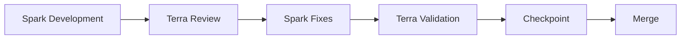

# Review Policy

## Policy

### Spark Development
- المرحلة التنفيذية الأولى باستخدام نموذج سريع ومحكوم.
- الهدف: بناء حل واضح ومباشر يطابق DoD الأساسي.

### Terra Review
- مراجعة مستقلة للقيود المعمارية، جودة القرارات، وتعامل الأمان.
- إذا ظهرت ملاحظات عالية الأولوية، تعود مباشرة إلى Spark Fixes.

### Spark Fixes
- معالجة ملاحظات المراجعة المحددة.
- يمنع تخطي أي ملاحظة `Critical/High` قبل التقدم.

### Terra Validation
- تحقق موازٍ على الجودة الشاملة، الاختبارات، والالتزام بالـ policy.

### Checkpoint
- اعتماد نهائي قبل الدمج: `DOD + Review + Validation`.

### Merge
- يعتمد فقط بعد اكتمال المراحل السابقة دون ملاحظات معلقة.
