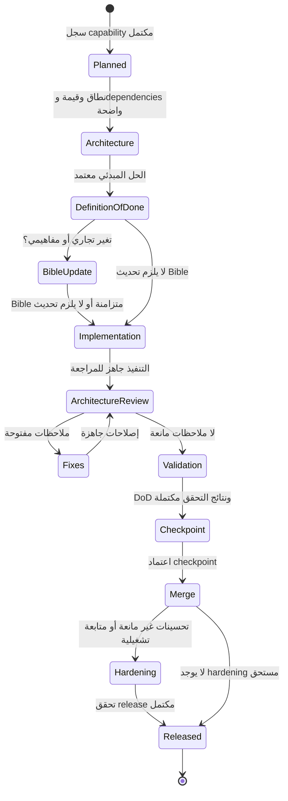

# Capability Lifecycle

## Lifecycle الرسمي

كل Capability يجب أن تمر بالحالات التالية بالترتيب. لا يُسمح بتجاوز بوابة دون توثيق الاستثناء في [Decision Log](12-decision-log.md).

## بوابات الانتقال

| الانتقال | الدليل المطلوب | صاحب الاعتماد |
| --- | --- | --- |
| Planned → Architecture | Purpose، Business Value، Dependencies | مسؤول الـ capability |
| Architecture → Definition of Done | حدود الحل، المخاطر، ونطاق التغيير | Architecture Review |
| Definition of Done → Implementation | DoD مخصصة ومراجعة Bible | مسؤول الـ capability |
| Implementation → Architecture Review | تنفيذ مكتمل للنطاق، نتائج أولية | المنفذ |
| Architecture Review → Validation | إغلاق Critical/High وملاحظات التصميم | Terra reviewer أو مراجع معتمد |
| Validation → Checkpoint | اختبارات، smoke، ومراجعة DoD | مالك الـ capability |
| Checkpoint → Merge | سجل checkpoint معتمد | المراجع المعتمد |
| Merge → Released | شروط الإصدار أو خطة hardening | Release owner |

تُفصّل قواعد الاعتماد في [Checkpoint Policy](11-checkpoint-policy.md)، وتصنيف الملاحظات في [Hardening Policy](07-hardening-policy.md).
