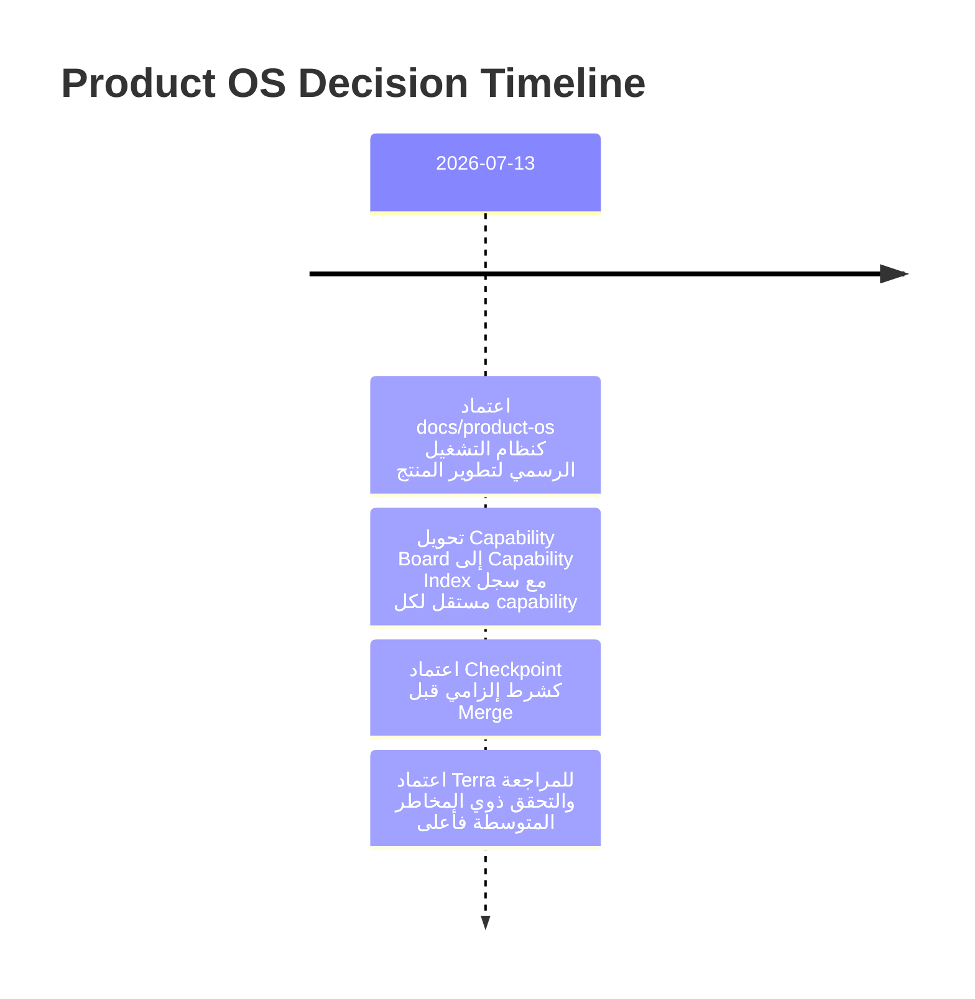

# Decision Log

## قواعد السجل

هذا السجل زمني وappend-only. يُضاف قرار جديد عند تغيير مسار Capability، قبول استثناء، اختيار نموذج AI غير اعتيادي، أو اتخاذ قرار حوكمة يؤثر على أكثر من مهمة واحدة. لا يُعدّل القرار السابق؛ تسجل القرارات اللاحقة كتصحيح أو إلغاء صريح.

| التاريخ | القرار | السبب | الأثر | المرجع/المالك |
| --- | --- | --- | --- | --- |
| 2026-07-13 | اعتماد Product OS الحالي كمرجع التشغيل الرسمي. | توحيد سير التطوير والمراجعة والدمج. | تصبح وثائق `docs/product-os` مرجع الحوكمة اليومي. | Product Operating System |
| 2026-07-13 | استبدال Capability Board بفهرس وسجل مستقل لكل Capability. | منع تكرار الحالة التشغيلية وإتاحة تاريخ تفصيلي لكل قدرة. | التحديثات تتم في سجل capability ثم في الفهرس عند تغير الحالة. | [Capability Index](03-capability-board.md) |
| 2026-07-13 | إلزام Checkpoint قبل Merge. | فصل حفظ العمل التقني عن اعتماد الجودة. | لا يتم Merge دون DoD + Review + Validation موثقة. | [Checkpoint Policy](11-checkpoint-policy.md) |
| 2026-07-13 | اعتماد Model Selection Policy. | مطابقة مستوى الاستدلال مع مخاطر المهمة. | Spark للتنفيذ المحدود وTerra للمراجعة/المخاطر الأعلى. | [AI Playbook](08-ai-development-playbook.md) |

## قالب قرار جديد

| التاريخ | القرار | السبب | الأثر | المرجع/المالك |
| --- | --- | --- | --- | --- |
| YYYY-MM-DD | وصف قرار قابل للاختبار | الدافع والسياق | capabilities أو سياسات متأثرة | رابط الدليل واسم المالك |
