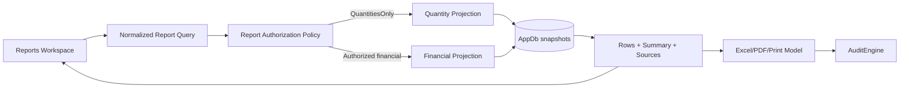

# Reports V1 - Reporting Workspace Discovery & Contract

**Document status:** Reports V1 implementation contract with Owner-approved salary decisions; implementation not started
**Discovery date:** 2026-07-18
**Scope:** Production quantities, financial production values, worker drill-down, Excel, PDF, and print
**Out of scope for this branch:** Backend implementation, Frontend implementation, schema changes, migrations, and export generation

## 1. Status language

This document uses four labels deliberately:

- **Verified:** present in the current repository and supported by code or tests.
- **Proposed:** recommended contract for Reports V1; not implemented or approved merely by appearing here.
- **Owner-approved:** business rule explicitly approved by the project owner for Reports V1; it remains an implementation requirement until code and tests exist.
- **Deferred:** explicitly outside Reports V1 or blocked by missing authoritative data.
- **Open Decision:** requires project-owner approval before implementation.

When an older document conflicts with executable code, this document treats current code and tests as the implementation truth and records the conflict as a gap.

## 2. Evidence reviewed

### 2.1 Product and architecture documentation

- `README.md`
- `docs/01-requirements.md`
- `docs/02-architecture-draft.md`
- `docs/05-data-model-draft.md`
- `docs/07-domain-model.md`
- `docs/08-backend-api-contracts.md`
- `docs/09-frontend-ux-contracts.md`
- `docs/product-bible/01-status-and-evidence.md`
- `docs/product-bible/05-source-of-truth.md`
- `docs/product-bible/11-production-execution.md`
- `docs/product-bible/12-compensation.md`
- `docs/product-bible/13-identity-access-and-permissions.md`
- `docs/product-bible/14-security-and-threat-boundaries.md`
- `docs/product-bible/15-audit-and-observability.md`
- `docs/product-bible/16-api-guidelines.md`
- `docs/product-bible/17-frontend-guidelines.md`
- `docs/product-bible/18-excel-import-export.md`
- `docs/product-bible/19-testing-strategy.md`
- `docs/product-bible/adrs/ADR-006-salary-history-entity.md`
- `docs/product-bible/adrs/ADR-007-product-model-stage-pricing-time.md`
- `docs/product-bible/adrs/ADR-008-output-quantity-separation.md`
- `docs/product-bible/adrs/ADR-010-capability-permission-authorization.md`
- `docs/product-bible/adrs/ADR-013-permission-catalog-product-controlled.md`
- `docs/product-os/02-delivery-workflow.md`
- `docs/product-os/04-definition-of-done.md`
- `docs/product-os/05-branch-strategy.md`
- `docs/product-os/capabilities/production-cost-recording.md`
- `docs/product-os/capabilities/production-cost-recording-v1-manual-smoke.md`

### 2.2 Backend implementation and tests

- `src/backend/ProductionLinePlanner.Domain/Entities/StageProductionRecord.cs`
- `src/backend/ProductionLinePlanner.Domain/Entities/StageProductionWorkerAllocation.cs`
- `src/backend/ProductionLinePlanner.Domain/Entities/ProductionOrder.cs`
- `src/backend/ProductionLinePlanner.Domain/Entities/ProductModel.cs`
- `src/backend/ProductionLinePlanner.Domain/Entities/ProductModelStage.cs`
- `src/backend/ProductionLinePlanner.Domain/Entities/Worker.cs`
- `src/backend/ProductionLinePlanner.Domain/Entities/AttendanceRecord.cs`
- `src/backend/ProductionLinePlanner.Domain/Entities/WorkerDefaultAssignment.cs`
- `src/backend/ProductionLinePlanner.Domain/Entities/WorkerTemporaryAssignment.cs`
- `src/backend/ProductionLinePlanner.Domain/Entities/WorkerSalaryHistory.cs`
- `src/backend/ProductionLinePlanner.Domain/Entities/AuditLog.cs`
- `src/backend/ProductionLinePlanner.Domain/Enums/StageProductionRecordStatus.cs`
- `src/backend/ProductionLinePlanner.Domain/Enums/ProductionOrderStatus.cs`
- `src/backend/ProductionLinePlanner.Domain/Enums/CompensationMode.cs`
- `src/backend/ProductionLinePlanner.Domain/Authorization/PermissionCatalog.cs`
- `src/backend/ProductionLinePlanner.Application/DTOs/ProductionCostRecordingDtos.cs`
- `src/backend/ProductionLinePlanner.Application/DTOs/WorkerSalaryHistoryDto.cs`
- `src/backend/ProductionLinePlanner.Application/Requests/ProductionCostRecordingRequests.cs`
- `src/backend/ProductionLinePlanner.Application/Requests/SetWorkerSalaryHistoryRequest.cs`
- `src/backend/ProductionLinePlanner.Application/Services/IWorkerCompensationService.cs`
- `src/backend/ProductionLinePlanner.Application/Engines/TimeAwareProductionAllocation.cs`
- `src/backend/ProductionLinePlanner.Application/Engines/IAttendanceEngine.cs`
- `src/backend/ProductionLinePlanner.Infrastructure/BusinessEngines/AttendanceEngine.cs`
- `src/backend/ProductionLinePlanner.Infrastructure/BusinessEngines/AssignmentEngine.cs`
- `src/backend/ProductionLinePlanner.Infrastructure/BusinessEngines/ProductionCostRecordingService.cs`
- `src/backend/ProductionLinePlanner.Infrastructure/BusinessEngines/WorkerCompensationService.cs`
- `src/backend/ProductionLinePlanner.Infrastructure/BusinessEngines/AuditEngine.cs`
- `src/backend/ProductionLinePlanner.Infrastructure/Data/Configurations/WorkerSalaryHistoryConfiguration.cs`
- `src/backend/ProductionLinePlanner.Infrastructure/Data/Migrations/20260713024755_EnforceUniqueCurrentWorkerSalary.cs`
- `src/backend/ProductionLinePlanner.Api/Endpoints/ProductionCostRecordingEndpoints.cs`
- `src/backend/ProductionLinePlanner.Api/Endpoints/WorkerPhotoEndpoint.cs`
- `src/backend/ProductionLinePlanner.Tests/ProductionCostRecordingServiceTests.cs`
- `src/backend/ProductionLinePlanner.Tests/ProductionCostRecordingHttpIntegrationTests.cs`
- Backend project files under `src/backend/*/*.csproj`

### 2.3 Frontend implementation and tests

- `src/frontend/package.json`
- `src/frontend/src/app/core/config/permission-identifiers.ts`
- `src/frontend/src/app/core/config/manufacturing-workspace.config.ts`
- `src/frontend/src/app/core/config/navigation.config.ts`
- `src/frontend/src/app/core/config/product-identity.config.ts`
- `src/frontend/src/app/core/services/production-cost-recording-api.service.ts`
- `src/frontend/src/app/pages/manufacturing-workspace/manufacturing-workspace-routing.module.ts`
- `src/frontend/src/app/pages/manufacturing-workspace/manufacturing-workspace.module.ts`
- `src/frontend/src/app/pages/manufacturing-workspace/production-cost-recording-page.component.ts`
- `src/frontend/src/app/pages/manufacturing-workspace/production-cost-recording-page.component.html`
- `src/frontend/src/app/pages/manufacturing-workspace/production-cost-recording-page.component.spec.ts`
- `src/frontend/src/app/pages/manufacturing-workspace/daily-production-operations-page.component.ts`
- `src/frontend/src/app/pages/manufacturing-workspace/daily-production-operations-page.component.html`
- `src/frontend/src/app/pages/manufacturing-workspace/daily-production-operations-page.component.scss`
- Shared product components under `src/frontend/src/app/shared/product/`, especially table, responsive-table, pagination, dialog/form-sheet, state, metadata, and action primitives
- `src/frontend/src/app/shared/ui/worker-avatar/worker-avatar.component.ts`
- `src/frontend/src/app/shared/design-system/tokens/design-tokens.scss`

## 3. As-Is verified facts

### 3.1 Current production data model

| Area | Verified source | Current facts |
|---|---|---|
| Production order/day | `ProductionOrder` | Has order number, model ID, optional line ID, production date, recorded-at time, planned quantity, source reference/import batch, and `Draft/Active/Completed/Cancelled` lifecycle. Daily Operations creates a Draft order whose planned quantity is the submitted line quantity. |
| Stage output | `StageProductionRecord` | Stores produced, accepted, and rejected quantities once per stage record plus immutable-looking snapshots of stage/model/factory/line/main-stage labels, piece price, standard seconds, compensation mode, and worker-earnings total. |
| Worker allocation | `StageProductionWorkerAllocation` | Stores worker ID and worker code/name snapshots, optional percentage/fixed amount/input quantity, equivalent quantity, calculated earning, notes, and manual override reason. It does not increase the stage's physical output. |
| Product/model | `ProductModel`, `ProductModelStage` | Model and model-stage relationship exist. Piece price, standard seconds, compensation mode, stage order, effective-from, and activity flags belong to `ProductModelStage`. |
| Factory structure | `Factory`, `ProductionLine`, `MainStage`, `SubStage` | Factory, line, main stage, and sub-stage exist. Stage production records keep display snapshots for these names/codes. |
| Worker | `Worker` | Worker ID, employee code, name, optional attendance IDs, optional local department, optional photo reference, employment status, and assignment navigation exist. |
| Attendance | `AttendanceRecord`, `AttendanceEngine` | A daily presence window is derived from the stored attendance record and its source payload (`FirstInUtc`, `LastOutUtc`). Missing or incomplete checkout remains not production-ready. |
| Assignments | default and temporary assignment entities plus `AssignmentEngine` | Default, Temporary, and Replacement types exist. Temporary participation is either `TemporaryMove` or `AdditionalParticipation`. |
| Daily override | Daily request/allocation flow | A daily addition/removal is validated at preview time. A manual override reason is stored on the allocation, but there is no dedicated persisted `IsDailyOverride` or assignment-type snapshot on the allocation. |
| Salary history | `WorkerSalaryHistory` | Historical amount/currency records exist, but they are separate from production earnings and are not part of the current daily production report. |
| Audit | `AuditLog`, `AuditEngine` | Application audit exists with safe-property filtering. Production writes record entity snapshots. There is no Export or Print action in `AuditActionType`. |

### 3.2 Current daily operation behavior

- **Verified:** a Daily Operations save creates one `StageProductionRecord` for every active model stage.
- **Verified:** each saved daily stage record receives the same submitted line quantity as both `ProducedQuantity` and `AcceptedQuantity`; `RejectedQuantity` is `0` in this workflow.
- **Verified:** the line quantity is therefore repeated across stage records by design. It represents the stage output grain, not an amount to sum across all stages for a physical finished-product total.
- **Verified:** workers are allocations within a stage record. Tests prove `500` output shared by two workers remains `500`, not `1000`.
- **Verified:** Daily Operations derives contribution minutes by intersecting assignment windows with the attendance first-in/last-out window, then uses a largest-remainder allocation to preserve exactly 100% and the rounded stage quantity.
- **Verified:** worker allocations and financial values are stored in Draft records and remain snapshot values through approval/cancellation.

### 3.3 Current report implementation

- **Verified:** `GET /api/production/reports/daily` accepts `from`, `to`, and optional order/model/worker filters.
- **Verified:** it returns Approved `StageProductionRecord` rows only and excludes Cancelled rows.
- **Verified:** it returns `StageCost`, compensation mode, worker percentages, equivalent quantities, fixed amounts, and calculated earnings.
- **Verified:** the endpoint requires only `production.view`.
- **Verified security gap:** a user with `production.view` receives financial values. The current endpoint cannot safely back a quantities-only UI.
- **Verified:** the frontend embeds a small daily approved-record table inside the production recording page and requests only today's report. It is not a reporting workspace.

### 3.4 Documentation drift

- `docs/product-bible/01-status-and-evidence.md` and `docs/product-bible/05-source-of-truth.md` still describe production output, allocations, model pricing, and salary history as absent/planned.
- The current domain contains those entities. Reports implementation must use current code/tests as truth and schedule a separate Product Bible reconciliation; this document does not modify the Bible.

### 3.5 Verified salary facts and gaps

- **Verified:** `Worker` has no mutable salary field. Base salary is stored in `WorkerSalaryHistory` as `Amount`, `CurrencyCode`, `EffectiveFrom`, and optional `EffectiveTo`, with audit fields and notes.
- **Verified:** effective intervals are half-open: a salary is active when `EffectiveFrom <= asOfUtc` and `EffectiveTo` is null or `EffectiveTo > asOfUtc`. Adjacent intervals are supported and tested.
- **Verified:** `WorkerCompensationService.GetCurrentSalaryAsync(workerId, asOfUtc)` resolves one effective record for a point in time. There is no current service that resolves all salary segments covering a From/To range or prorates them.
- **Verified:** application writes reject overlapping historical intervals, and a filtered unique database index prevents more than one open-ended record per worker. The database does not independently exclude every overlap between closed intervals; concurrent range writes still require a transaction/locking decision.
- **Verified:** `Amount` is `decimal(18,4)`, `CurrencyCode` defaults to `EGP`, the entity and API permit zero, and the controlled intake path converts an imported zero to no salary record.
- **Verified storage gap:** neither the entity nor its DTO stores pay cadence, monthly/weekly/daily unit, payroll divisor, scheduled working days, or payroll calendar. The Owner-approved Reports V1 business contract defines `Amount` as a monthly base salary despite this storage omission.
- **Verified storage gap:** production earning snapshots have no currency code. The Owner-approved Reports V1 business contract treats production earnings and salary as EGP; a future hardening slice may snapshot the production-earnings currency.
- **Verified gap:** current permissions expose salary history through broad `compensation.view`; no salary-report-specific permission exists.
- **Verified gap:** salary is not snapshotted on production records. A later correction to salary history can change a newly generated comparison for an old production period; production earnings themselves remain stored snapshots.

### 3.6 Owner-approved salary business contract for Reports V1

- `WorkerSalaryHistory.Amount` represents a monthly base salary for Reports V1.
- Both salary and production earnings are EGP in Reports V1. A non-EGP salary segment is not comparable and must produce a review/mismatch status, never a converted value.
- Salary baseline uses calendar-day proration only: for every calendar month and intersecting effective salary segment, `monthly salary * covered calendar days / calendar days in that month`.
- The report spans multiple months by summing every covered month/segment. Actual attendance days, scheduled working days, and other payroll divisors are not used.
- Salary visibility requires both `reports.financial.view` and the Owner-approved `reports.worker-salary.view`. Salary-bearing export/print also requires `reports.financial.export`.
- Financial UI shows both `الراتب الأساسي الشهري المرجعي` and `الراتب الأساسي المحتسب للفترة`; it never compares daily/weekly earnings to a full monthly amount without the period baseline.
- The approved primary labels are `أرباح الإنتاج`, `أرباح الإنتاج كنسبة من الراتب`, `الراتب الأساسي للفترة`, and `إجمالي الراتب الأساسي + أرباح الإنتاج`. `القيمة المضافة` is not a primary standalone label.
- `إجمالي الراتب الأساسي + أرباح الإنتاج` is analytical only. It always includes `قيمة تحليلية لا تمثل صافي كشف الرواتب النهائي.` and never represents payroll, deductions, taxes, absence, overtime, or a pay-slip amount.
- An effective zero salary is `InvalidOrReviewRequired`, not an automatically valid base salary and not silently missing data. It blocks the ratio and combined analytical total.

## 4. Data lineage and calculation contract

### 4.1 Metric lineage

| Metric | Authoritative source and grain | Current form | Rule | Reporting constraint |
|---|---|---|---|---|
| Stage production quantity | `StageProductionRecord.ProducedQuantity`, one stage record | Persisted snapshot | Non-negative; not derived from workers | May be summed only within a clearly declared stage-record grain. Never multiply or aggregate it by worker rows. |
| Accepted quantity | `StageProductionRecord.AcceptedQuantity` | Persisted snapshot | Non-negative; `Accepted + Rejected <= Produced` | Same stage-grain constraint as produced quantity. |
| Rejected quantity | `StageProductionRecord.RejectedQuantity` | Persisted snapshot | Non-negative | Same stage-grain constraint as produced quantity. Daily Operations currently saves zero. |
| Physical finished-product total | No independent completed-product output entity/terminal-stage rule | **Missing authoritative aggregate** | Not defined | **Open Decision:** do not label a sum across stages as total production. |
| Worker count | Distinct `WorkerId` values from allocations after status/filter rules | Runtime projection from persisted allocations | Count distinct workers, not allocation rows, for cross-stage totals | State whether the count is distinct workers or participations. |
| Participation percentage | `StageProductionWorkerAllocation.Percentage` | Persisted, nullable | Required and totals 100% only in `SharedPercentage` | Not meaningful for `FullRatePerWorker` or `FixedAmount`. |
| Worker allocated quantity/share | `EquivalentQuantity` | Persisted calculated snapshot | Shared mode: rounded `AcceptedQuantity * Percentage / 100`; other modes currently store zero | Report as nullable/not-applicable outside SharedPercentage; do not present zero as a real physical allocation. |
| Raw imported worker quantity | `InputQuantity` | Persisted optional source evidence | Explicitly not stage/line production | Deep source detail only; never use as an aggregate production metric. |
| Attendance window | `AttendanceRecord.SourcePayload` via `AttendanceEngine` | Runtime projection of historical attendance record | First-in and valid last-out for the production date | Not frozen on the production allocation. Label as attendance evidence, not production snapshot. |
| Contribution duration | `TimeAwareProductionAllocation.CalculateContribution` | Runtime during Daily Operations | Intersection of assignment windows and attendance, floor to whole minutes | Not persisted on the allocation; exact historical reporting is not guaranteed after source/assignment changes. |
| Assignment/participation type | Assignment entities and Daily Operations context | Runtime | Default, Temporary/Replacement, or daily override | Not snapshotted on allocation. Daily override can only be inferred from a manual reason, which is insufficient as a contract. |
| Stage piece price | `StageProductionRecord.SnapshotPiecePrice` | Persisted financial snapshot | Copied from `ProductModelStage.PiecePrice` at record creation | Financial response only. Do not join the current model-stage price for historical reports. |
| Worker entitlement | `StageProductionWorkerAllocation.CalculatedEarning` | Persisted calculated snapshot | Shared: `EquivalentQuantity * PiecePrice`; FixedAmount: fixed amount; FullRatePerWorker: `AcceptedQuantity * PiecePrice` per worker | Financial response only. Backend is the source of truth. |
| Stage cost/worker earnings total | `StageProductionRecord.TotalWorkerEarnings` | Persisted snapshot | Must equal the sum of stored worker calculated earnings | Financial response only. |
| Worker total entitlement | Sum of `CalculatedEarning` over included allocations | Runtime aggregate over persisted snapshots | Filter by report status/date/scope before summing | Financial response only; group by `WorkerId`, never name. |
| Reference monthly base salary | `WorkerSalaryHistory.Amount` plus currency/effective interval | Stored historical record; not a production snapshot | **Owner-approved business contract:** Amount is monthly for Reports V1; resolve by worker and instant using half-open effective intervals | Salary-sensitive response only. Schema does not store cadence, so the report must document the contract. |
| Production earnings | Sum of stored `CalculatedEarning` for the worker over included records/allocations | Runtime aggregate over financial snapshots | Apply date/status/entity filters first; group by `WorkerId` and allocation ID | Financial response only. Never recalculate from current price or duplicate across stage/product joins. |
| Salary baseline for period | No persisted field or current engine | **Missing; Owner-approved runtime calculation** | Sum calendar-day-prorated monthly salary effective segments for the report period | If a required segment is missing, zero, or non-EGP, return availability status and no numeric baseline. |
| Production earnings to salary ratio | No persisted field | **Missing; Owner-approved runtime calculation** | `ProductionEarnings / SalaryBaselineForPeriod * 100` only for complete, positive, EGP baseline | Unavailable for missing/partial/zero/review-required or non-EGP salary segments. |
| Combined base and production | No persisted field | **Missing; Owner-approved runtime calculation** | `SalaryBaselineForPeriod + ProductionEarnings` only when the baseline is complete, positive, and EGP | Label `إجمالي الراتب الأساسي + أرباح الإنتاج`; analytical only, never net payroll/payroll due. |
| Compensation/distribution mode | `SnapshotCompensationMode` | Persisted snapshot | SharedPercentage, FullRatePerWorker, FixedAmount | Treat as financial configuration and omit from QuantitiesOnly unless the owner explicitly approves exposure. |
| Department | `Worker.LocalDepartmentName` | Current master data | No worker-department snapshot on allocation | Display only as “current department” or omit from historical exports. |
| Worker photo | current protected worker photo endpoint | Current optional presentation | Not a production snapshot | Worker card only; not embedded by default in exports. |
| Record status | `StageProductionRecord.Status` | Persisted | Draft, Approved, Cancelled | Default totals use Approved only. |

### 4.2 Non-negotiable quantity rule

For a stage output of `500` with two workers at `50%`:

- Stage production quantity = `500`.
- Worker A allocated quantity = `250`.
- Worker B allocated quantity = `250`.
- Worker allocations may sum to `500` in SharedPercentage mode, but they do not create two production outputs.
- A report joining the stage row to workers must aggregate stage quantity once per `RecordId`, not once per joined allocation row.

### 4.3 Rounding and totals

- **Verified:** quantities are rounded to 3 decimals with `MidpointRounding.AwayFromZero`.
- **Verified:** money is rounded to 4 decimals with `MidpointRounding.AwayFromZero`.
- **Proposed:** report calculations consume stored rounded snapshots; they must not recalculate historical earnings from current prices.
- **Proposed:** display precision may be shorter than storage precision, but Excel numeric cells retain authoritative precision.
- **Proposed:** every aggregate includes a source-count and exposes drill-down references for reconciliation.

### 4.4 Effective salary and period-baseline contract

Salary history must be resolved across the complete inclusive report-date interval, not by taking the latest row or the salary effective on `To`.

1. Split the report interval at calendar-month boundaries and every effective salary boundary.
2. Resolve exactly one salary record and one currency for every resulting segment using the existing half-open effective interval rule.
3. Apply the Owner-approved calendar-day proration rule to each covered segment, then sum the segment baselines once per `WorkerId`.
4. A full month with one effective salary contributes that monthly base salary exactly once.
5. A mid-month salary change contributes two prorated segments; a multi-month report sums each month/segment rather than multiplying the current salary by month count.
6. A gap in salary coverage makes the worker baseline incomplete. Do not substitute zero and do not emit ratio or combined compensation as if complete.
7. A worker appearing in multiple stages/products still has one baseline for the report period. Join aggregated production earnings to the worker-grain salary result after both sides are independently aggregated.

**Owner-approved policy:** for each calendar month and each intersecting effective salary segment, calculate `monthly salary * covered calendar days / calendar days in that month`. Sum every segment/month for multi-month reports. Do not use attendance days, scheduled working days, or another payroll divisor.

**Technical implementation gap:** the current service resolves one `asOfUtc` point only. Phase 4B must add a range resolver, apply the existing UTC effective boundaries consistently to report dates, and retain segment source IDs. This is an implementation task, not an unresolved business decision.

### 4.5 Salary comparison metrics and availability

- **Production Earnings / أرباح الإنتاج:** sum of stored allocation `CalculatedEarning` in the filtered report scope.
- **Production Earnings to Salary Ratio / أرباح الإنتاج كنسبة من الراتب:** `ProductionEarnings / SalaryBaselineForPeriod * 100`. A value of 25% means production earnings equal 25% of the base-salary baseline for the same period; it is not a permanent raise or net income.
- **Combined Base and Production / إجمالي الراتب الأساسي + أرباح الإنتاج:** analytical sum of the complete period baseline and production earnings. Never label it `صافي الراتب` or `الراتب المستحق`.

Use an explicit availability contract rather than unexplained nullable fields:

- `Available`: complete EGP salary coverage and the Owner-approved calendar-day baseline.
- `PartialCoverage`: at least one report segment has no effective salary; baseline/ratio/combined are absent.
- `MissingSalaryHistory`: no salary record intersects the period; baseline/ratio/combined are absent.
- `InvalidOrReviewRequired`: an explicit zero salary segment covers the period. It is neither accepted baseline data nor silently missing; baseline/ratio/combined are absent.
- `CurrencyUnavailableOrMismatch`: at least one salary segment is not EGP, or EGP comparability cannot be established; baseline/ratio/combined are absent.

Salary segments, unavailable reasons, and source salary-history IDs accompany the status. Null is valid only when the status explains it.

## 5. Lifecycle contract

### 5.1 Verified states

| Entity | States |
|---|---|
| Stage production record | Draft, Approved, Cancelled |
| Production order | Draft, Active, Completed, Cancelled |

### 5.2 Proposed report defaults

- Default date range: current production day.
- Default record status: Approved only.
- Default presentation: QuantitiesOnly.
- Draft and Cancelled may be selected explicitly in operational-detail views by users with production-report view permission.
- Draft and Cancelled records are excluded from business totals unless the user explicitly selects a non-approved audit context; the UI must label such totals “غير معتمد” or “ملغي” rather than mixing them with Approved totals.
- Cancelled financial snapshots remain available only in an authorized source drill-down and never contribute to current financial totals.

No new lifecycle state is proposed.

## 6. Security and authorization model

### 6.1 Current state

- `production.view` currently permits orders, records, readiness, daily operations, and the financial daily report.
- `compensation.view` and `compensation.export` exist, but the production report endpoint does not require them.
- The permission catalog is product-controlled in backend code and mirrored in the frontend.
- UI permission checks are usability controls only; Backend authorization is authoritative.

### 6.2 Proposed permissions requiring owner approval

The following are conceptual names requested for the capability, mapped to the repository's dotted catalog convention:

| Concept | Proposed catalog identifier | Purpose |
|---|---|---|
| ViewProductionReports | `reports.production.view` | Query quantities-only summaries, rows, and source references without financial fields. |
| ViewFinancialReports | `reports.financial.view` | **Owner-approved Reports V1 identifier.** Query financial summaries, prices, modes, and entitlements. Must also imply or require production report view. |
| ExportProductionReports | `reports.production.export` | Export quantities-only Excel/PDF and print quantities views. |
| ExportFinancialReports | `reports.financial.export` | **Owner-approved Reports V1 identifier.** Export or print any report containing financial values. Must also require financial view. |
| ViewWorkerSalaryReports | `reports.worker-salary.view` | **Owner-approved Reports V1 identifier.** Receive base salary, salary segments, period baseline, salary comparison, and salary-data status. Requires financial report view. |

`reports.production.view` and `reports.production.export` remain **Proposed**. `reports.financial.view`, `reports.financial.export`, and `reports.worker-salary.view` are Owner-approved for Reports V1 but are not implemented in the catalog. Role assignments and defaults remain an **Open Decision**; no role should be assumed merely from its name.

### 6.3 No-leak rules

1. QuantitiesOnly uses a response type that has no financial properties. It is not a financial DTO with null/hidden fields.
2. QuantitiesOnly SQL/projection must not select piece price, fixed amount, calculated earning, stage cost, total entitlement, salary, or financial audit payloads.
3. Financial query, drill-down, Excel, PDF, and print each re-authorize on the Backend.
4. Column visibility and CSS are never authorization boundaries.
5. Cached frontend report data is cleared when mode or effective permissions change.
6. Export jobs/models store the authorized presentation mode and permitted column set; the client cannot submit arbitrary property names.
7. Error payloads, totals metadata, chart series, tooltips, filenames, and applied-filter labels must follow the same no-leak policy.
8. Existing `/api/production/reports/daily` must be deprecated, restricted to financial permission, or replaced before Reports Workspace is released. It must not remain a `production.view` financial bypass.
9. Financial authorization has two layers: `reports.financial.view` may expose production earnings, but salary fields require `reports.worker-salary.view` as well.
10. A user without salary permission receives a response type/projection with no salary amount, baseline, ratio, combined total, segment, status, or salary-history source ID. Omission is enforced before serialization, not with nulls or UI hiding.
11. Salary-bearing Excel/PDF/print requires financial export permission plus salary view permission. Audit records that salary-sensitive data was exported, but never stores salary values or worker-level rows in metadata.

## 7. Reports V1 information architecture

### 7.1 Views included in V1

| View | V1 status | Primary grain | Notes |
|---|---|---|---|
| Production overview | Included with constraint | Report scope and record counts | Physical “total production” awaits an aggregation decision; safe cards are still available. |
| Production by stage | Included | Stage production record or stage aggregate | Core quantities view. |
| Production by worker | Included | Worker aggregate from allocations | Equivalent quantity is applicable only for SharedPercentage. |
| Worker -> stages | Included | Worker with stage allocation rows | Uses record/allocation IDs for source drill-down. |
| Stage -> workers | Included | Stage record with worker allocations | Stage quantity rendered once; worker shares underneath. |
| Production by product/model | Included | Model + stage aggregate | Must preserve stage grain and snapshot labels. |
| Operational details | Included | Individual StageProductionRecord | Can include Draft/Cancelled when explicitly selected. |
| Financial report | Included behind permission | Same views with financial extension | Separate Backend contract and export authorization. |

### 7.2 Deferred views/data

- Payroll, base salary, deductions, taxes, and salary-history reporting.
- Exact historical attendance/assignment/daily-override facts until the snapshot decision is approved and implemented.
- OEE, machine downtime, production speed, shift targets, and IoT metrics.
- Scheduled/email exports, report subscriptions, dashboards, and saved server-side report definitions.
- Variance from standard cost or standard time.
- Multi-currency aggregation.
- A canonical finished-product total until the production-grain decision is approved.

## 8. Filter contract

### 8.1 V1 filters

| Filter | Data support | Contract |
|---|---|---|
| From / To | Verified | Required, inclusive production dates. Validate From <= To and enforce a configurable maximum range. |
| Factory | Partially verified historically | Filter through order line/current factory ID; display record snapshot name. No snapshot factory ID exists. |
| Production line | Verified | `ProductionOrder.ProductionLineId`; display snapshot code/name from record. |
| Product/model | Verified | `ProductionOrder.ProductModelId`; display record snapshot code/name. |
| Production order | Verified | `ProductionOrderId` and order number. |
| Stage | Verified | `ProductModelStageId`; display snapshot stage code/name. |
| Worker | Verified | Allocation `WorkerId`; display snapshot worker code/name. Never match by name. |
| Record status | Verified | Draft, Approved, Cancelled. Default Approved. |
| Assignment type | Not historically authoritative | Deferred until assignment type/daily override is snapshotted, or exposed explicitly as “reconstructed evidence” after owner approval. |
| Compensation/distribution mode | Verified snapshot | Financial mode only by default. |

### 8.2 Dependency and loading order

1. Restore a versioned local filter state, then validate it against current permissions.
2. Load date range and factory options.
3. Factory selection constrains production lines.
4. Line and date constrain production orders and relevant models.
5. Model and line constrain stages.
6. Worker uses server-side ID/code/name search and is not matched by display name.
7. Changing an upstream filter clears invalid downstream selections.
8. Query execution is explicit through “تطبيق الفلاتر”; dependent lookup loading must not execute the main report repeatedly.

### 8.3 Local persistence and reset

- **Verified gap:** no reusable non-auth filter persistence adapter exists in current frontend code.
- **Proposed:** add a versioned `ReportFilterPersistenceAdapter` backed by local storage, scoped by report family and user ID, containing IDs/dates/view/mode only.
- Never persist returned rows, financial totals, worker photos, or permission decisions.
- “إعادة الضبط” returns to current production day, Approved, QuantitiesOnly, first view, and cleared entity filters.
- If financial permission is lost, restoration downgrades to QuantitiesOnly before any query.

## 9. Presentation modes

### 9.1 QuantitiesOnly

- Summary, rows, worker card, drill-down, exports, and print contain no financial values.
- No piece price, fixed amount, calculated earning, stage cost, worker entitlement, salary, or currency fields are returned.
- Compensation mode is omitted by default because it describes financial calculation behavior.
- Available to `reports.production.view`; export/print additionally requires `reports.production.export`.

### 9.2 QuantitiesAndFinancials

- Adds financial summary cards and financial row extensions to the same selected business view.
- Requires `reports.financial.view`; export/print additionally requires `reports.financial.export`.
- Switching modes executes a new Backend query. It never reveals already-loaded hidden fields.
- Production earnings and salary are separate sensitivity tiers. Financial mode may show earnings to a financial-report user while omitting the entire salary-comparison extension unless the salary permission is also effective.

### 9.3 Cross-surface behavior

| Surface | QuantitiesOnly | QuantitiesAndFinancials |
|---|---|---|
| Summary cards | Quantity/status metrics only | Quantity cards plus authorized financial cards |
| Tables | Quantity columns only | Adds price, mode, stage cost, entitlement as applicable |
| Worker card | Identity, participation quantities, record sources | Adds entitlement per stage and worker total |
| Drill-down | Quantity and operational source fields | Adds financial snapshots and calculations |
| Excel | No financial sheets/columns/formulas/metadata | Authorized financial columns and totals |
| PDF | No financial values in body/header/footer | Financial title/values and audited generation |
| Print | Quantity print model only | Re-authorized financial print model and audit |
| API | Dedicated quantity DTO | Dedicated financial DTO |

Within the financial column, salary comparison is a separately authorized extension. QuantitiesOnly never receives either earnings or salary. QuantitiesAndFinancials without salary permission receives production earnings but no salary-sensitive members.

## 10. Worker card contract

### 10.1 Recommended UX

**Proposed:** a reusable right-side report detail Drawer on desktop/tablet, full-screen on mobile.

Rationale:

- Preserves the report, filters, sorting, and scroll position.
- Supports rapid next/previous worker review on Android tablet.
- Provides more vertical space than a centered dialog for 10-20 stage records.
- Reuses PrimeNG overlay/focus patterns already present in App Shell rather than introducing a framework.

The Drawer has a sticky identity header, internally scrollable content, and sticky close/source actions. A dedicated route is deferred until deep-linking or cross-module worker analytics is required.

### 10.2 Worker card fields

| Section | QuantitiesOnly | Financial extension | Provenance |
|---|---|---|---|
| Identity | Current name/code, current department clearly labelled, optional current protected photo | None | Worker master data; allocation snapshot name/code shown when different |
| Scope | Period and applied factory/line/model filters | Mode/currency label | Query metadata |
| Presence | Attendance evidence per production date when available; first-in, last-out, duration | None | AttendanceRecord; not a production snapshot |
| Participation | Stage names/codes, record status, percentage where applicable, allocated quantity where applicable | Compensation mode | Allocation and record snapshots |
| Assignment | Only an authoritative snapshot if added; otherwise “غير محفوظ وقت التسجيل” | None | Current schema gap |
| Totals | Record count, distinct stages, applicable allocated quantity | Total entitlement | Filtered report projection |
| Sources | Record ID/order ID/allocation ID/date/status and “عرض المصدر” | Stored price and earning snapshot | StageProductionRecord and allocation IDs |

### 10.3 Financial income summary

When both financial and salary permissions are effective, the Worker Drawer adds one flat `ملخص الدخل خلال الفترة` metric block, not nested cards:

- Effective reference base salary amount and currency, labelled `الراتب الأساسي الشهري المرجعي`.
- `الراتب الأساسي للفترة` from the complete approved proration result.
- `أرباح الإنتاج` once, with the secondary explanation `لا تمثل صافي كشف الرواتب النهائي.`
- `أرباح الإنتاج كنسبة من الراتب`.
- `إجمالي الراتب الأساسي + أرباح الإنتاج` with a persistent note: `قيمة تحليلية لا تمثل صافي كشف الرواتب النهائي.`
- Salary data status, coverage period, segment count, and a short segment breakdown when salary changes during the report.
- Production earnings drill-down to allocation/stage/record sources. Salary baseline drill-down references salary-history segments separately.

The primary numbers use typography, while cadence, proration method, data status, and disclaimer are secondary text. The block stacks without horizontal scrolling on Android tablet; missing/partial status replaces comparison numbers rather than showing zeros.

### 10.4 Missing-value behavior

- Missing checkout: show `وقت الانصراف غير متاح`; do not manufacture duration.
- Non-SharedPercentage quantity share: show `غير منطبق`, not `0`.
- Missing photo: use the existing worker avatar fallback.
- Current department differing from historical context: label `القسم الحالي`.
- Unknown assignment type: show `غير محفوظ في لقطة الإنتاج`.

## 11. Summary cards

### 11.1 Guaranteed V1 quantity cards

- Number of Approved production records.
- Number of production orders in scope.
- Distinct participating workers.
- Distinct stages.
- Accepted quantity at the explicitly selected stage/report grain.
- Rejected quantity at the explicitly selected stage/report grain.

### 11.2 Conditional/deferred quantity cards

- **Total production:** requires the physical-output aggregation decision. Do not sum repeated daily stage quantities.
- **Working hours:** requires an approved definition using attendance evidence or a persisted contribution snapshot.
- **Average productivity:** deferred until both a non-duplicated production numerator and authoritative working-hours denominator exist.

### 11.3 Financial additions

- Total worker entitlements/stage costs: sum stored `TotalWorkerEarnings` once per included record.
- Worker entitlement total: sum stored `CalculatedEarning` per worker.
- Average unit cost: deferred until the denominator grain/currency decision is approved.
- Base salary is included only through the separately authorized salary-sensitive extension; it is never inferred from production earnings.
- For worker-containing reports with salary permission, add: total salary baseline for the period, total production earnings, combined base plus production, average production earnings per included worker, aggregate earnings-to-baseline ratio, and count of workers with incomplete/review-required salary data.
- The primary ratio is the weighted aggregate for the same complete-data cohort: `sum ProductionEarnings for workers with complete baseline / sum complete SalaryBaseline * 100`, accompanied by included/excluded worker counts and the separate all-worker Production Earnings total. Do not mix earnings from incomplete workers into this ratio or present an unweighted average of worker percentages as the main KPI.
- If an arithmetic mean of individual ratios is ever shown, label it explicitly `متوسط نسب العمال` and keep it secondary; it answers a different question from the aggregate ratio.
- Salary baseline totals aggregate once per `WorkerId` for the report period, never once per stage, product, allocation, or displayed row.

## 12. Table contract

### 12.1 Production by stage

Core columns:

- Date, order number, factory snapshot, line snapshot, model snapshot.
- Main stage, stage code, stage name.
- Record status.
- Produced, accepted, rejected.
- Distinct participating workers.

Financial extension:

- Snapshot piece price.
- Compensation mode.
- Stage cost/total worker earnings.

Drill-down: Stage -> workers with stage quantity shown once in the expansion/header.

### 12.2 Production by worker

Core columns:

- Worker code and snapshot/current name distinction.
- Current department when requested and clearly labelled.
- Production-record count and distinct-stage count.
- Applicable allocated quantity total; non-applicable allocations counted separately.
- Date range and last participation date.

Financial extension:

- Total entitlement.
- When salary permission is present: reference base salary, period salary baseline, production earnings, earnings-to-baseline ratio, combined analytical total, and salary-data status at worker grain.

Drill-down: Worker -> compact stage-record rows.

Salary values belong in the worker summary/group header and must not be repeated as if each stage owned a separate salary.

### 12.3 Production by model

Core columns:

- Model snapshot code/name.
- Distinct orders, records, stages, and workers.
- Produced/accepted/rejected values grouped by stage grain.

Financial extension:

- Total stage costs.
- Cost breakdown by compensation mode.

### 12.4 Operational details

- Record ID/source link, order, production/recorded/approval/cancellation dates.
- Factory, line, model, main stage, stage snapshots.
- Status and cancellation reason.
- Produced, accepted, rejected.
- Worker participations.
- Financial snapshot only in financial mode.
- If a worker is visible and salary permission is present, show the worker-level salary comparison once beside the worker summary; never attach the baseline to every allocation row.

### 12.5 Stage -> workers salary behavior

- Financial + salary mode may show each distinct worker's period baseline, production earnings, ratio, combined analytical total, and salary status.
- Production earnings respect the selected stage scope; salary baseline remains the same report-period worker baseline and is clearly labelled as such.
- Cross-stage totals deduplicate salary baseline by `WorkerId`. A worker participating in multiple stages/products contributes once to the salary total, while each allocation contributes once to production earnings.

### 12.6 Common behavior

- Backend/server pagination and sorting; maximum page size follows API guidance (`<= 200`).
- Stable sorting uses ID as a final tie-breaker.
- Totals are returned by Backend for the full filtered scope, not calculated from one page.
- Column definitions come from shared report configuration; exports consume the same approved definitions.
- Mandatory identity/quantity columns cannot be hidden. User visibility preferences apply only to permitted optional columns.
- Long names use ellipsis plus accessible tooltip; codes use isolated LTR.
- Loading, empty, error, and unauthorized states reuse shared product state components.
- Desktop/tablet landscape use a comparison table with sticky identity/action columns.
- Tablet portrait/mobile use stacked responsive entity rows for non-essential columns; no financial data is fetched merely because a hidden column exists.
- No horizontal overflow on Android tablet portrait. Landscape may use the existing controlled `plpResponsiveTable="scroll"` behavior only when comparison columns cannot safely stack.

## 13. Drill-down and source-of-number contract

Every summary/row exposes a typed source reference:

```text
ReportSourceReference
- sourceType: StageProductionRecord | StageProductionWorkerAllocation | ProductionOrder | AttendanceRecord
- sourceId: Guid
- recordId: Guid?
- allocationId: Guid?
- productionOrderId: Guid?
- workerId: Guid?
- productionDate: DateOnly
- snapshotCreatedAtUtc: DateTime?
```

**Verified gap:** the current allocation DTO omits allocation ID even though the entity has one. The report read contract should expose it for source navigation.

Drill-down rules:

1. A summary total lists its grouped record IDs or a server-side source query token, never an unbounded client ID list.
2. Stage quantity opens the contributing stage records, not worker rows.
3. Worker entitlement opens allocations, each linked to its stage record.
4. Snapshot values show a `Snapshot` marker; current master data shows a `Current` marker.
5. Attendance evidence is visually separated from stored production snapshots.
6. Source endpoints enforce the same presentation mode and permissions as the parent report.

## 14. Proposed Backend architecture

### 14.1 Capability components

- `ProductionReportQuery` / specification: normalized filters, view, sort, pagination, and mode.
- `ProductionReportAuthorizationPolicy`: validates endpoint, mode, export action, and effective permissions before query execution.
- `ProductionReportEngine`: coordinates read projections only; endpoints remain thin.
- Quantity summary and row projections that never select money.
- Financial summary and row projections that extend quantity facts only after authorization.
- `ReportSourceReference` projection for drill-down.
- `ReportExportModelBuilder` consuming the same authorized column/summary definitions.
- `ReportAuditService` recording export/print metadata without row payloads.

### 14.2 Data flow



### 14.3 What must not be duplicated

- Filter normalization and validation.
- Permission/mode checks.
- Financial field allow-listing.
- Quantity and money rounding/display formatters.
- Status labels and snapshot/current labels.
- Export columns and table columns.
- Stage quantity and worker-allocation calculation rules.
- Worker identity/photo presentation.
- Attendance range/duration formatting.
- Effective salary segmentation, proration, availability, currency compatibility, and worker-grain deduplication.

## 15. Proposed API contract

### 15.1 Recommended route separation

Route separation is recommended over one polymorphic response because it makes accidental financial serialization harder:

| Endpoint | Permission | Response |
|---|---|---|
| `GET /api/reports/production/quantities` | `reports.production.view` | Quantity-only summary/rows; no financial properties |
| `GET /api/reports/production/financials` | `reports.financial.view` | Financial response with quantity base and financial extension |
| `GET /api/reports/production/financials/workers/salary-comparisons` | `reports.financial.view` + `reports.worker-salary.view` | Salary-sensitive worker-grain comparison projection |
| `GET /api/reports/production/quantities/sources/{sourceId}` | `reports.production.view` | Quantity source detail |
| `GET /api/reports/production/financials/sources/{sourceId}` | `reports.financial.view` | Authorized financial source detail |
| `POST /api/reports/production/quantities/exports/excel` | view + `reports.production.export` | Generated quantity workbook |
| `POST /api/reports/production/financials/exports/excel` | view + `reports.financial.export` | Generated financial workbook |
| Equivalent PDF endpoints | matching export permission | Server-generated PDF |
| `POST .../print-audit` or server print-model endpoint | matching export permission | Re-authorized print model/audit result |

### 15.2 Query shape

```text
ProductionReportFilter
- view: Overview | ByStage | ByWorker | WorkerStages | StageWorkers | ByModel | OperationalDetails
- from: DateOnly
- to: DateOnly
- factoryId: Guid?
- productionLineId: Guid?
- productModelId: Guid?
- productionOrderId: Guid?
- productModelStageId: Guid?
- workerId: Guid?
- statuses: StageProductionRecordStatus[] (default Approved)
- compensationModes: CompensationMode[]? (financial endpoint only)
- sort: approved server field + direction
- page: int >= 1
- pageSize: int <= 200
```

Assignment-type filtering is absent until an authoritative historical contract exists.

### 15.3 Response shape

Both responses contain:

- Query metadata and normalized applied filters.
- Generated-at UTC and authoritative timezone label.
- Pagination metadata.
- Backend-calculated summary.
- Typed rows.
- Allowed column metadata.
- Source/drill-down references.
- Warnings, including unavailable historical attendance/assignment evidence.

The quantity response type contains no financial members. The financial response uses separate financial row/summary types rather than nullable fields on the quantity types.

### 15.4 Salary-sensitive response concept

Names remain **Proposed** until aligned with final API naming conventions:

```text
WorkerFinancialSummary
- workerId
- referenceBaseSalaryAmount
- referenceSalaryCadence: Monthly
- currencyCode
- salaryBaselineForPeriod
- productionEarnings
- productionEarningsToSalaryRatio
- combinedBaseAndProduction
- salaryDataStatus
- salarySegmentsCount
- salarySegments[]: salaryHistoryId, effectiveFrom, effectiveTo, amount, currency, proratedBaseline?
- unavailableReason?
```

This is not added to the generic quantity or earnings DTO. Prefer a dedicated salary-sensitive projection/endpoint so users with financial earnings access but without salary access cannot receive salary members. `salaryDataStatus` is mandatory; comparison values are optional only according to that status, never through unexplained nulls.

## 16. Proposed Frontend architecture

- `ReportsWorkspacePage`: orchestration only.
- `ReportFilterBar`: dependent lookup UI and apply/reset actions.
- `ReportViewSelector`: view state.
- `ReportPresentationModeSelector`: displayed only when financial view permission exists; defaults safely to QuantitiesOnly.
- `ReportSummaryRenderer`: configuration-driven cards using response summary.
- `ReportTable`: shared PrimeNG table shell plus report column configuration.
- `ReportWorkerDrawer`: reusable worker detail and source drill-down.
- `ReportExportActionBar`: permissions, loading, errors, and download/print actions.
- `ReportFilterPersistenceAdapter`: versioned local persistence of filter IDs/state only.
- Shared report formatters for quantity, money, time range, duration, status, and LTR code isolation.

Reuse the existing PrimeNG stack, shared table/pagination/responsive directives, state shells, product actions, form-sheet/overlay patterns, Worker Avatar, design tokens, and Cairo typography. Do not introduce a new UI framework.

## 17. Excel contract

### 17.1 Workbook structure

1. **Summary** sheet: report title, mode, period, generated-at/by, non-sensitive applied filters, summary metrics, and warnings.
2. **Details** sheet: typed report rows at the selected view grain.
3. **Applied Filters** sheet or a fixed header block when the report is small.
4. Optional **Sources** sheet only when source references are requested and bounded; no raw audit JSON.

### 17.2 Formatting and behavior

- Dates are native Excel dates; quantities and money are numeric cells, not formatted strings.
- Currency uses an explicit currency code after the currency decision.
- Freeze panes below the header and enable auto-filter.
- Set deterministic Arabic-friendly column widths and wrap long names.
- Use formulas only for transparent sheet totals; Backend totals remain authoritative and are included for reconciliation.
- Protect header/formula cells if editing is not intended.
- File name: `DAYOUB_<report-type>_<mode>_<from>_<to>_<generated-at>.xlsx` using filesystem-safe English tokens.
- QuantitiesOnly omits financial columns, formulas, named ranges, hidden sheets, comments, and metadata completely.
- Financial export re-authorizes and audits at generation time.
- Salary-authorized worker exports add numeric reference salary, period baseline, production earnings, combined analytical total, a native percentage cell for the ratio, segment count, and salary-data status.
- Summary totals are computed from a worker-grain sheet/model. Stage/allocation details may reference a worker key but must not repeat salary cells in formulas that multiply the baseline.
- Salary-bearing files state the Owner-approved calendar-day proration method and incomplete/review-required-worker count. QuantitiesOnly and financial-without-salary exports contain no salary columns, hidden cells, formulas, comments, or metadata.

### 17.3 Implementation direction

- **Verified:** ClosedXML already exists in Backend Infrastructure, but is currently used for workbook ingestion/bootstrap parsing, not report generation.
- **Proposed:** generate Excel server-side with ClosedXML and shared export models. Do not add a client-side Excel library.

## 18. PDF contract

- Product identity: `DAYOUB - منصة ديوب`, report title, presentation mode, and confidentiality marker for financial reports.
- Include period, generated-at UTC/local display, generated-by, and applied filters.
- Summary precedes detail table.
- Use A4 portrait for concise worker/overview reports and landscape for multi-column stage/operational reports.
- Repeat table headers, show page `x / y`, and avoid splitting identity/source groups when possible.
- Embed an Arabic-capable font and apply true RTL shaping. Frontend uses Cairo through `@fontsource/cairo`, but no server PDF/font package is currently configured.
- QuantitiesOnly and Financial use separate authorized render models.
- Do not render a hidden DOM screenshot as the authoritative financial PDF.
- Salary-authorized PDF includes a concise financial-income section, calendar-day proration method, coverage status, and note: `قيمة تحليلية لا تمثل صافي كشف الرواتب النهائي.` Salary values are absent from all other PDF models.

**Proposed direction:** server-side PDF for consistent authorization, audit, pagination, and exports.
**Open Decision:** PDF library/license and the approved embedded Arabic font asset. No PDF library exists in current Backend or Frontend packages.

## 19. Print contract

- Create a dedicated report print layout; do not print the raw workspace.
- Hide App Shell, filter controls, mode selector, pagination controls, tooltips, and action buttons.
- Keep product/report title, period, applied filters, mode, generated-at/by, summary, table headers, and source footnotes.
- Repeat table headers and avoid row clipping.
- Use explicit portrait/landscape print classes selected by report configuration.
- Respect RTL while isolating codes/numbers only where required.
- QuantitiesOnly never receives financial DOM.
- Financial print requires a fresh Backend permission check and an audit event before opening the print dialog.
- Salary-authorized print uses the same worker-grain totals and disclaimer as PDF; salary content is absent unless both financial export and salary view permissions pass.

**Verified gap:** no `@media print` contract or print action exists in the current frontend.

## 20. Audit contract

Audit the following successful and denied-sensitive actions:

- Excel export.
- PDF export.
- Financial print.
- Optional quantity print/export according to retention policy.

Safe metadata:

- Report view and presentation mode.
- From/to.
- Non-sensitive entity IDs or a normalized filter hash.
- Record count and page/export size.
- Generated file type.
- Correlation/request ID and outcome.
- A boolean/classification that the export contained salary-sensitive data, without amounts or worker identities.

Do not audit full rows, worker names, salaries, entitlements, raw filter display text, file bytes, or access tokens.

**Verified gap:** `AuditActionType` has no Export or Print values.
**Proposed:** add deterministic Export/Print actions or a report-specific audited action contract after owner approval; reuse `AuditEngine` safe serialization.

## 21. Phased implementation roadmap

### Phase 0 - Owner decision gate

- **Scope:** approve the remaining open decisions in section 24, especially production grain, historical presence snapshots, report permission catalog/role assignments, default range, and PDF strategy.
- **Expected layers:** documentation/configuration decisions only.
- **Acceptance:** decisions recorded without turning proposals into facts.
- **Tests:** none.
- **Schema change:** no.
- **Dependency:** none; blocks later phases where noted.
- **Risk:** implementing totals or presence before decisions creates irreconcilable reports.

### Phase 1 - Secure quantities report engine

- **Scope:** normalized filter/specification, quantity-only projections, summary, pagination/sorting, source references, safe Approved default, and deprecate/restrict the leaking daily report.
- **Expected layers:** Domain permission catalog, Application report contracts/engine interface, Infrastructure query engine, thin API endpoints, Backend tests.
- **Acceptance:** `reports.production.view` never receives financial JSON; stage quantity is not duplicated by allocation joins; Cancelled excluded by default; totals reconcile to source records.
- **Tests:** unit calculation/grain tests, integration query/filter/pagination tests, 401/403 and JSON property absence tests, legacy endpoint no-bypass test.
- **Schema change:** no; permission seed/reconciliation data may change after approval.
- **Dependency:** Phase 0 permissions and production-grain decisions.
- **Risk:** ambiguous cross-stage total. Omit that card until approved rather than inventing a formula.
- **Independent:** yes after decisions.

### Phase 2 - Reports workspace shell and quantities UX

- **Scope:** route/navigation, filter bar, reset/persistence adapter, view selector, quantity summaries/tables, source drill-down, responsive states.
- **Expected layers:** frontend report feature folder plus shared report configuration/formatters; reuse existing product components.
- **Acceptance:** tablet-first layout, no horizontal overflow in portrait, dependent filters clear safely, state restoration cannot enable financial mode, source drill-down preserves table/filter state.
- **Tests:** component/service/guard tests, responsive DOM tests, Playwright desktop/tablet visual QA, accessibility checks.
- **Schema change:** no.
- **Dependency:** Phase 1.
- **Risk:** wide operational tables; use server column configuration and responsive entity rows.

### Phase 3 - Worker card and historical drill-down

- **Scope:** Worker Drawer, worker/stage bidirectional drill-down, current photo/department labels, attendance evidence, source provenance.
- **Expected layers:** report query projections, worker photo reuse, frontend shared Worker Drawer/presence formatter.
- **Acceptance:** every value identifies Snapshot/Current/Attendance Evidence; missing checkout and non-applicable allocation handled safely; names joined by ID only.
- **Tests:** provenance, missing-data, worker/stage consistency, long-name/tablet/focus tests.
- **Schema change:** **conditional.** Required if exact assignment type, daily override, attendance window, and contribution minutes at record time are mandatory.
- **Dependency:** Phase 1-2 and historical snapshot decision.
- **Risk:** reconstructing historical state from mutable/current data. Recommended mitigation is a minimal immutable allocation evidence snapshot, not inference.

### Phase 4A - Production financial mode and no-leak hardening

- **Scope:** financial permissions, dedicated earnings query/DTO, production financial summaries/columns/worker entitlement, mode switch; no base-salary fields.
- **Expected layers:** permission catalog/seed, report authorization policy, financial projections, frontend permission-aware mode/configuration.
- **Acceptance:** unauthorized users receive 403 and no financial properties; financial totals equal stored record/allocation totals; permission loss clears cached financial state.
- **Tests:** response-shape no-leak tests, role/user deny tests, totals consistency, frontend guard/directive/cache tests.
- **Schema change:** no for the Owner-approved EGP-only V1 business contract. A future hardening slice may add production-earnings currency snapshots for multi-currency support.
- **Dependency:** Phases 1-3 and implementation of the Owner-approved financial permission catalog mappings.
- **Risk:** the existing daily report remains a bypass unless removed/restricted in Phase 1.

### Phase 4B - Salary comparison and worker-grain aggregation

- **Scope:** effective salary range resolver, Owner-approved calendar-day proration, salary availability/status contract, worker-grain baseline aggregation, salary-sensitive authorization, Worker Drawer income summary, and salary comparisons in worker-containing views.
- **Expected layers:** Application salary-period contracts and engine interface, Infrastructure range resolver/projection, report authorization policy, dedicated salary-sensitive API projection, frontend financial metric block and table group configuration.
- **Acceptance:** fixed/mid-period/multi-month salary histories resolve by the Owner-approved monthly/calendar-day segment policy; missing/zero/non-EGP data never produces a false ratio; salary baseline aggregates once per worker across stages/products; production earnings reconcile to allocation drill-down; no salary member reaches a user without salary permission.
- **Tests:** fixed salary, mid-period change, one day, full month, multiple months, no history, partial coverage, `InvalidOrReviewRequired` zero segment, zero-division protection, several stages/products without baseline duplication, zero earnings, non-EGP salary segment, financial-without-salary permission, response property absence, worker totals, and source reconciliation.
- **Schema change:** no. Current effective intervals supply the read calculation under the Owner-approved contract. Future hardening may add production-earnings currency snapshots, immutable salary comparison snapshots, payroll calendar/divisor data, or stronger database overlap enforcement.
- **Dependency:** Phase 4A.
- **Risk:** later salary-history correction changes a regenerated historical comparison because salary is not snapshotted on production records; label/report generation time and source segments clearly.

### Phase 5 - Excel export

- **Scope:** shared export model/columns, quantity, earnings, and salary-authorized workbook generators, filters/summary/details sheets, download endpoints, audit.
- **Expected layers:** Application export contracts, Infrastructure ClosedXML generator, API endpoints, frontend action bar.
- **Acceptance:** native types, freeze/filter/widths, quantity workbook contains no financial cells/hidden artifacts, financial permission rechecked, file audit recorded.
- **Tests:** workbook structure/content tests with ClosedXML, permission tests, no-leak scans, filename tests.
- **Schema change:** no.
- **Dependency:** Phase 1 and Phase 4A for earnings export; Phase 4B for salary-bearing export.
- **Risk:** large ranges and formula drift; enforce bounded ranges and compare workbook totals with Backend summary.

### Phase 6 - PDF and print

- **Scope:** authorized PDF renderer, embedded Arabic font, print model/layout, page headers/footers, financial print audit.
- **Expected layers:** server PDF adapter, export model reuse, frontend print route/styles/actions.
- **Acceptance:** correct RTL shaping, repeated headers/page numbers, no clipped rows, correct orientation, quantity no-leak, financial re-authorization/audit.
- **Tests:** PDF text/metadata tests plus rendered-page visual QA; print stylesheet Playwright screenshots; authorization tests.
- **Schema change:** no.
- **Dependency:** PDF library/font decision and Phases 1/4A/5; Phase 4B for salary-bearing output.
- **Risk:** Arabic shaping and pagination; run render-based QA, not file-exists tests.

### Phase 7 - Full hardening

- **Scope:** performance, accessibility, tablet/desktop/mobile visual QA, large dataset behavior, permission revocation, audit verification.
- **Expected layers:** all report layers and test suites.
- **Acceptance:** agreed query SLA, bounded memory, keyboard/screen-reader coverage, no overflow, no financial leakage across all surfaces.
- **Tests:** full frontend/backend, load tests, E2E, visual regression, security matrix.
- **Schema change:** no unless performance evidence requires indexes; any index migration is evidence-driven.
- **Dependency:** all prior phases.
- **Risk:** query fan-out and large exports.

## 22. Acceptance criteria for Reports V1

1. Quantity totals never multiply stage output by worker count.
2. QuantitiesOnly responses/files/print DOM contain no financial fields or values.
3. Financial views and every financial output action are Backend-authorized.
4. Approved is the safe default; Draft/Cancelled never silently enter Approved totals.
5. Stored snapshot values drive historical financial output.
6. Worker and stage views reconcile to the same allocation IDs and totals.
7. Every aggregate can drill to bounded source references.
8. Missing historical attendance/assignment evidence is labelled, not inferred as fact.
9. Excel uses native types and omits forbidden columns completely.
10. PDF and print support Arabic/RTL without clipping and repeat headers.
11. Export/financial print audit excludes sensitive row payloads.
12. Desktop, 1100px laptop, Android tablet landscape, Android tablet portrait, and mobile remain usable.
13. Loading, empty, error, unauthorized, and no-results states use the shared product system.
14. No report calculation is duplicated between templates, components, and exporters.
15. A salary effective for one instant is resolved with the repository's half-open interval rule; period reports resolve every intersecting segment rather than the latest record.
16. One-day, full-month, mid-month-change, and multi-month baselines use the Owner-approved monthly calendar-day proration and declare it in output metadata.
17. Missing or partial salary history does not become zero; baseline, ratio, and combined total are unavailable with an explicit status.
18. An explicit zero salary segment is `InvalidOrReviewRequired` and never causes division by zero or an infinite/false ratio.
19. A worker participating in several stages or products contributes one salary baseline to report totals, while each production allocation contributes once to earnings.
20. Production Earnings reconcile exactly to the included stored `CalculatedEarning` allocation sources.
21. QuantitiesOnly contains neither earnings nor salary fields. Financial-without-salary permission contains earnings but no salary-sensitive properties or source IDs.
22. Excel uses numeric salary/earnings cells and a native percentage ratio; worker-grain formulas cannot multiply salary through detail rows.
23. PDF/print salary sections require both financial export and salary view authorization and carry the non-payroll disclaimer.
24. Export audit may state that salary-sensitive data was included but contains no salary values or worker rows.
25. Salary comparison is withheld when any salary segment is not EGP or EGP comparability cannot be established; production earnings are treated as EGP only under the Owner-approved V1 contract.

## 23. Explicit deferred scope

- Backend/Frontend implementation in this discovery branch.
- Database migrations in this discovery branch.
- New reporting framework or replacement of PrimeNG.
- Payroll execution, net salary, taxes, deductions, overtime, absence adjustments, settlements, and payslip generation. Reports V1 includes only the Owner-approved analytical base-salary comparison.
- Cost variance, forecasting, recommendations, and scheduled reports.
- Email/cloud exports.
- Multi-tenant/line-scoped ABAC.
- Machine/shift/OEE analytics.
- Import redesign.
- Product Bible reconciliation, which should be a separate docs checkpoint.

## 24. Open decisions requiring owner approval

1. **Physical production grain:** What authoritative rule defines “إجمالي الإنتاج” across multiple stage records: a terminal stage, a separate completed-output record, or a Daily Operations order-level quantity restricted to that workflow? **Recommendation:** do not ship the card until this is explicit.
2. **Historical worker evidence:** Must Reports V1 show exact assignment type, daily override, attendance window, and worker minutes as they were at record creation? **Recommendation:** yes; add a minimal immutable allocation evidence snapshot in a later implementation phase rather than reconstructing mutable history.
3. **Report permission catalog and roles:** Approve or rename the remaining proposed report identifiers, place the Owner-approved `reports.financial.view`, `reports.financial.export`, and `reports.worker-salary.view` in the catalog, and approve all system-role assignments.
4. **Legacy daily report:** Remove, deprecate, or immediately restrict `/api/production/reports/daily` to financial permission? **Recommendation:** restrict/deprecate in Phase 1 before the new UI is exposed.
5. **Statuses:** Should users with production report permission be allowed to query Draft/Cancelled operational details, or should this require an audit/approval permission? **Recommendation:** Approved-only totals; explicit operational status access with clear labels.
6. **Department/photo history:** Is current department/photo sufficient in the worker card, clearly labelled Current, or must it be snapshotted? **Recommendation:** current presentation is sufficient; do not embed photos in exports.
7. **Compensation mode visibility:** May quantities-only users see the distribution mode? **Recommendation:** no; treat it as financial configuration.
8. **PDF technology:** Approve a server PDF library/license and an embeddable Cairo-compatible Arabic font.
9. **Default date range:** Confirm current production day versus another bounded default. **Recommendation:** current production day for safety and performance.

## 25. Recommended first implementation slice

Start with **Phase 1: Secure quantities report engine**, after answering decisions 1, 3, 4, 5, and 9.

The first slice should deliver only:

- Approved-by-default quantity query.
- Stage-record and source-reference grain.
- Date/factory/line/model/order/stage/worker/status filters that are currently authoritative.
- Backend summary and pagination.
- A quantity DTO with compile-time absence of financial properties.
- Security/integration tests proving `production.view` or any non-financial permission cannot receive money through either the new or legacy route.

This slice creates the safe foundation for UI, Worker Drawer, and exports without committing to unresolved physical-total or historical-presence assumptions.
